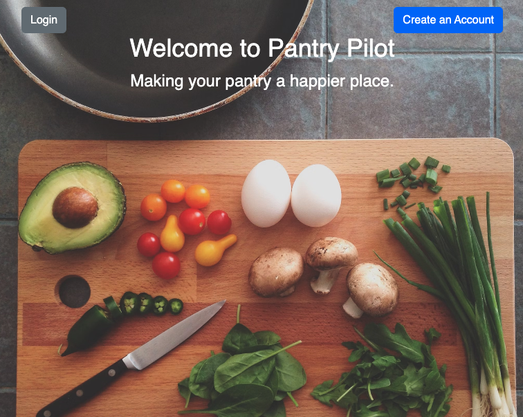

# Pantry Pilot Documentation
- [Pantry Pilot frontend Repo](https://github.com/Pantry-Pilot/pantry_pilot_fe)
- [Pantry Pilot backend Repo](https://github.com/Pantry-Pilot/pantry_pilot_be)

Please note: since this is built as a SOA you will need to clone both repos, and have the servers running in addition to the Redis server and SideKiq. 

## Built With

## Gems and testing 
- [Faraday](https://github.com/lostisland/faraday) gem to interact with APIs
- [JSONAPI Serializer](https://github.com/jsonapi-serializer/jsonapi-serializer) gem for formatting JSON responses
- [SimpleCov](https://github.com/simplecov-ruby/simplecov) gem for code coverage tracking
- [Sidekiq](https://sidekiq.org/) gem for background workers
- [ShouldaMatchers](https://github.com/thoughtbot/shoulda-matchers) gem for testing assertions
- [Capybara](https://github.com/morris-lab/Capybara) gem for end to end testing 
- [Lanchy](https://github.com/copiousfreetime/launchy) gem for inspection and debugging
- [jsbundling-rails](https://github.com/rails/jsbundling-rails) / [cssbundling-rails](https://github.com/rails/cssbundling-rails) gems for styling 
- [omniauth](https://github.com/omniauth/omniauth) / [omniauth-rails_csrf_protection](https://github.com/cookpad/omniauth-rails_csrf_protection) / [omniauth-google-oauth2](https://github.com/zquestz/omniauth-google-oauth2) gems for OAuth

- [Postman](https://www.postman.com/) to check API endpoints
- [VCR](https://github.com/vcr/vcr) / [Webmock](https://github.com/bblimke/webmock) to stub HTTP requests in tests to simulate API interactions

## About this Project
Pantry Pilot is an application designed to simplify meal planning by enabling users to effortlessly search for and store recipes utilizing basic ingredients readily available in their kitchen pantries. The project harnesses the power of the [spoonacular](https://spoonacular.com/food-api) API to curate a wide range of recipes, from "Chicken and Rice" classics to more intricate dishes.

Key Features:

Recipe Search: Users can swiftly discover a multitude of recipes by entering specific queries.

Email Recipe Sharing: A user-friendly feature allows for easy sharing of recipes with friends and family through email. This functionality is powered by ActionMailer and efficient background workers.

Recipe Image Upload: Users can enhance their recipe collection by uploading images of dishes they've prepared. This feature seamlessly integrates with AWS S3 for secure and accessible image storage.

Styling and Accessibility: We've incorporated CSS and Bootstrap to style the application, ensuring a modern and user-friendly design. Pantry Pilot is also designed with mobile users in mind and complies with WCAG guidelines to support individuals with visual impairments.

Pantry Pilot is your all-in-one solution for discovering, collecting, and sharing delicious recipes that suit your unique culinary journey.

## Getting Started
Before running Pantry Pilot, ensure you have the following:

- Ruby on Rails environment set up
- All required servers running (e.g., your Rails server, database server)
- Dependencies from the Gemfile installed using bundle install

## Usage
Register and Log In:

Start by registering for an account or logging in if you already have one.
User Dashboard:

Once logged in, you will be directed to your User Dashboard.
Recipe Search:

In your User Dashboard, you can search for recipes by using one or more keywords. The application will return the top 10 recipes in that category.
Saving Recipes:

Users can save recipes to their dashboard for easy access later.
Email Recipe Sharing:

The application provides the ability to share recipes with friends and family via email.
Upload Recipe Images:

On your dashboard, you can upload images of the recipes you have prepared.
Viewing Uploaded Photos:

Your uploaded recipe photos will be displayed on your dashboard for quick reference.
Pantry Pilot streamlines the process of discovering, storing, and sharing your favorite recipes based on the ingredients available in your pantry. Enjoy your culinary journey!

## OAuth
If users are registered with a gmail account they can use the Google OAuth integratation. This feature gives users the option to log in quickly and efficiently using their Google accounts. This streamlined process simplifies access to Pantry Pilot and offers a seamless user experience.

Now, users can select "Log In with Google" to gain immediate access to Pantry Pilot without the need to remember additional login credentials. Enjoy the enhanced user experience provided by Google OAuth with Pantry Pilot!

## Screenshots of final product 
1. Landing page:

2. Login page:

3. Top of the Recipe show page

4. Bottom of Recipe show page

## Contributors
- [Antoine Aube](https://www.linkedin.com/in/antoineaube/)                - GitHub: [@Antoine-Abube](https://github.com/Antoine-Aube)
- [Jorja Flemming](https://www.linkedin.com/in/jorjaf/)                   - GitHub: [@jorjaf](https://github.com/jorjaf)
- [Lane Bretschneider](https://www.linkedin.com/in/lanebretschneider/)    - GitHub: [@lanebret85](https://github.com/lanebret85)
- [Will Chen](https://www.linkedin.com/in/williamfchen/)                  - GitHub: [@williamfchen](https://github.com/williamfchen)
